# LinkUp — Real-Time Chat Application

A modern, elegant, and fully-featured real-time chat application built with **Flutter** and **Firebase**. LinkUp provides a seamless experience for instant messaging, media sharing, and user management with a focus on clean code, responsive UI, and robust data management.

---

## App Screenshots Preview

<div align="center">
  <h3>Onboarding & Home</h3>
  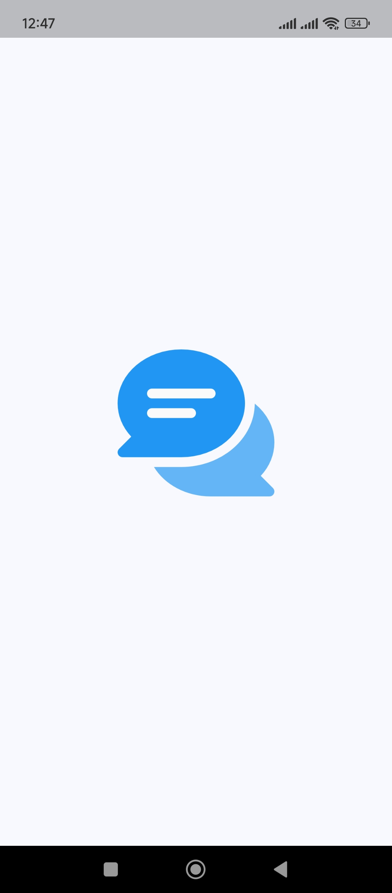
  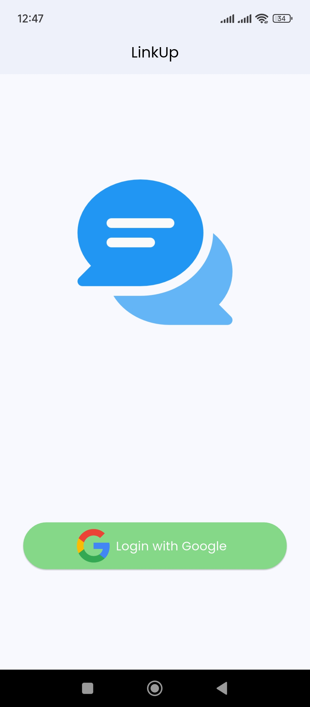
  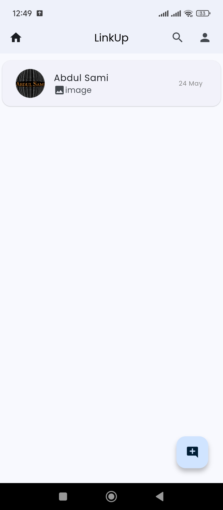
</div>

<br/>

<div align="center">
  <h3>Chat Experience</h3>
  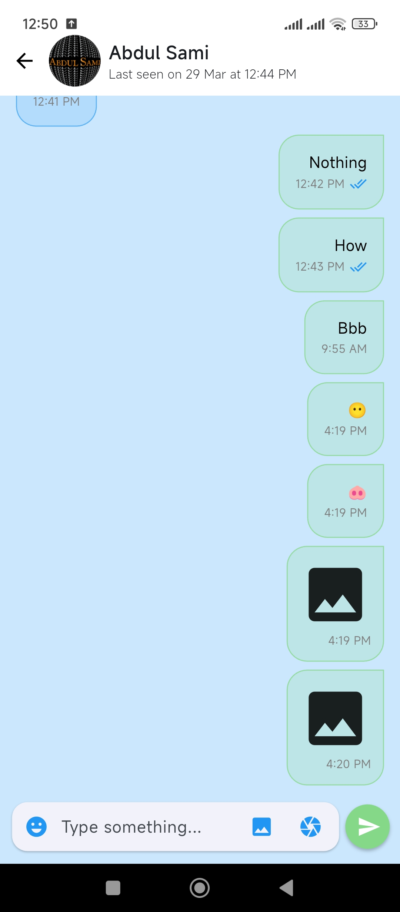
  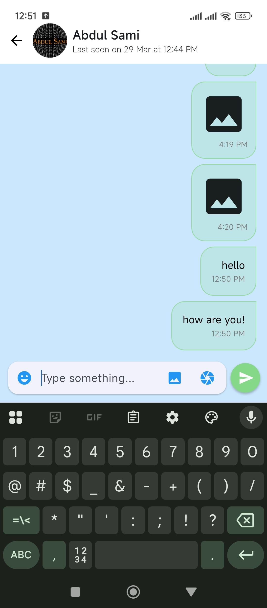
  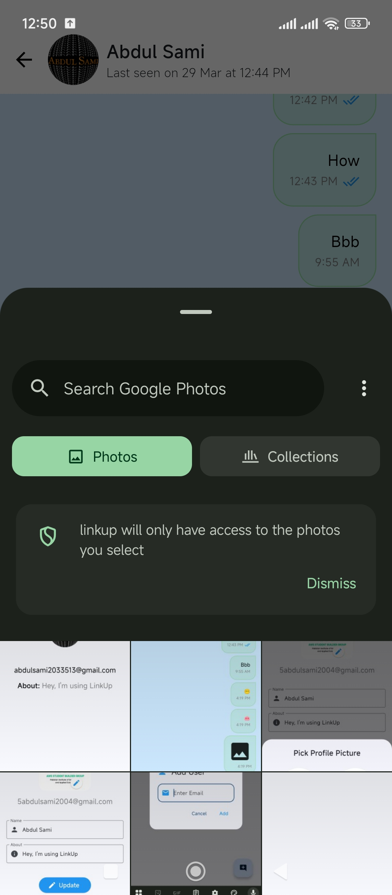
</div>

<br/>

<div align="center">
  <h3>Profile & Details</h3>
  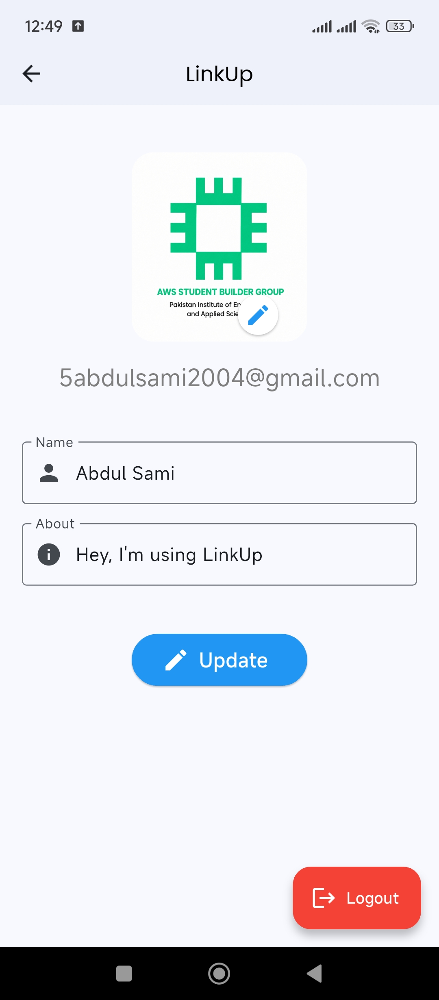
  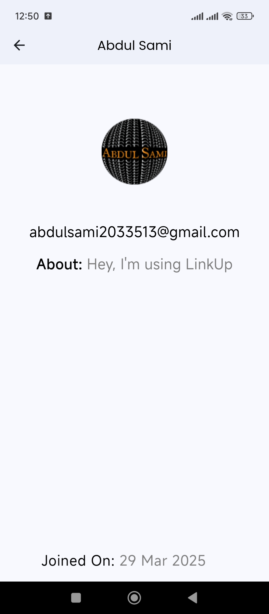
  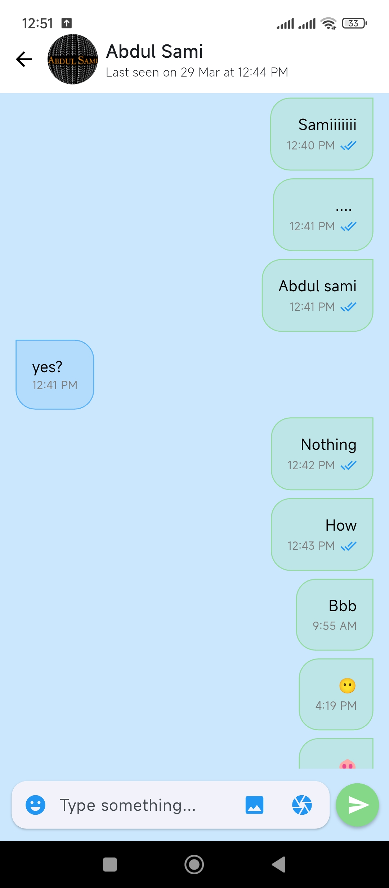
</div>

<br/>

<div align="center">
  <h3>User Management</h3>
  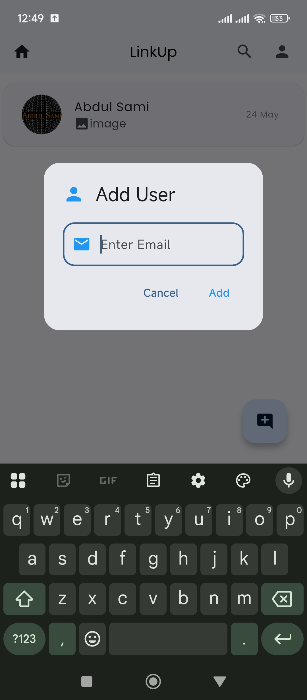
  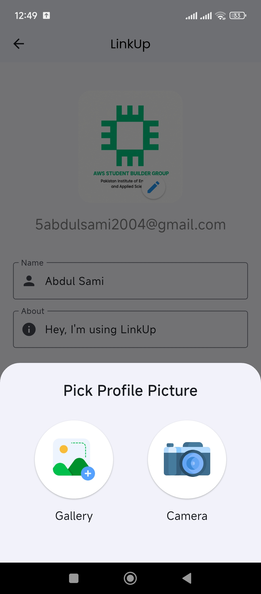
</div>

---

## Key Features

### Real-Time Messaging
* **Instant Delivery:** Messages are delivered in real-time powered by Firebase Firestore.
* **Read Receipts:** Visual indicators for sent and read messages (single and double blue ticks).
* **Online Status:** See when your contacts are online or their last seen time.
* **Message Operations:** Support for deleting and editing messages after sending.

### Authentication & User Management
* **Google Sign-In:** Secure and seamless onboarding with Google accounts.
* **Profile Customization:** Update your profile picture, name, and "about" status.
* **Add Contacts:** Add users by their email address to start chatting.

### Media & Notifications
* **Image Sharing:** Send images directly from your camera or gallery.
* **Image Saving:** Save received images to your device's gallery.
* **Push Notifications:** Stay updated with real-time notifications for new messages using Firebase Cloud Messaging (FCM).
* **Emoji Support:** Integrated emoji picker for expressive messaging.

---

## Architecture & Tech Stack

LinkUp follows a clean architecture pattern separating API logic, models, and presentation layers, ensuring a highly scalable and maintainable codebase.

### Core Tech Stack
* **Framework:** Flutter (Dart)
* **Backend:** Firebase (Auth, Firestore, Storage, Cloud Messaging)

### Key Libraries
* **UI Utilities:** `google_fonts`, `cached_network_image`
* **Media Operations:** `image_picker`, `emoji_picker_flutter`, `image_gallery_saver`
* **Network & API:** `http`, `googleapis_auth`

---

## Getting Started

### Prerequisites
* Flutter SDK
* Dart SDK
* An Android/iOS Emulator or Physical Device
* Firebase project setup (Google Services files required)

### Installation

1. **Clone the repository:**
   ```bash
   git clone https://github.com/5-abdulsami/chat_app.git
   cd chat_app
   ```

2. **Install dependencies:**
   ```bash
   flutter pub get
   ```

3. **Run the app:**
   ```bash
   flutter run
   ```

---

## Project Structure

```text
lib/
├── api/          # Firebase interaction and API services
├── auth/         # Authentication logic
├── helper/       # Helper functions and dialogs
├── model/        # ChatUser and Message data models
├── utils/        # Utility functions and constants
├── view/         # UI Screens (Home, Chat, Profile, Login, Splash)
└── widgets/      # Reusable UI components
```

---

## Author

**Abdul Sami**

- GitHub: [@5-abdulsami](https://github.com/5-abdulsami)
- Website: [abdulsami.live](https://abdulsami.live/)
- Email: [5abdulsami2004@gmail.com](mailto:5abdulsami2004@gmail.com)
- LinkedIn: [Abdul Sami](https://www.linkedin.com/in/5abdul-sami/)

---
